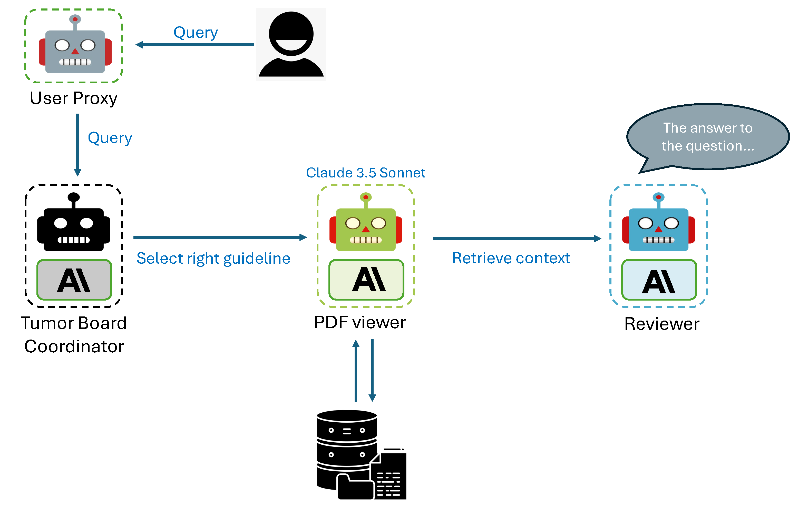

# ASCO Guideline Agents



## Overview

This repository provides tools for evaluating and processing ASCO (American Society of Clinical Oncology) guidelines using a multi-agent framework with Claude as the underlying model. It supports automated retrieval, review, and evaluation of clinical questions against ASCO guidelines. This repository also provides a brand new QA dataset of 100 questions and answers from ASCO guidelines.

The multi-agent framework is implemented using Autogen. The workflow begins when a user submits a query to the User Proxy agent. This query is then forwarded to the Tumor Board Coordinator, which analyzes the question and determines the most relevant ASCO guideline by accessing its database of guideline summaries. Once the appropriate guideline is identified, the PDF Viewer agent retrieves and processes the specific guideline document from the PDF, utilizing Claude's PDF support function. Finally, the Reviewer agent examines the extracted information, formulates a clear and concise answer to the original query, and ensures the response accurately reflects the ASCO guidelines. 

## Features

1. **Automated PDF Retrieval**:
   - Automatically downloads ASCO guideline published from 2020 to 2024 for streamlined access.

2. **Claude Integration**:
   - Uses the Anthropic's Claude model to respond to clinical queries.
   - Includes multiple agents to coordinate guideline retrieval, review, and user interaction.

3. **Answer Evaluation**:
   - Compares generated answers to expected answers to assess accuracy and guideline alignment.
   - Generates detailed evaluation reports for question-answer pairs.

4. **Configurable Evaluation**:
   - Supports command-line arguments for flexible evaluation setups (e.g., specific question ranges, custom seeds).

## Files

### 1. `claude_autogen.py`
- Contains the implementation of the `ClaudeChat` class, which manages interactions with the Claude model.
- Agents include:
  - **Coordinator**: Determines the appropriate guideline for a question.
  - **PDF Viewer**: Extracts information from guideline PDFs.
  - **Reviewer**: Reviews responses for accuracy and provides final answers.

### 2. `config.py`
- Handles environment configuration and API key loading using a `.env` file.
- Example variable:
  - `ANTHROPIC_API_KEY`: API key for Claude integration.

### 3. `evaluate_answers.py`
- Provides tools to evaluate the accuracy of Claude's answers against predefined expected answers.
- Key functionalities:
  - Compare generated and expected answers.
  - Extract guideline usage from chat messages.
  - Save evaluation results to CSV.

### 4. `run_evaluation.py`
- Script for running batch evaluations of questions against guidelines.
- Command-line arguments:
  - `--start`: Starting index of questions.
  - `--end`: Ending index of questions.
  - `--seed`: Cache seed for Claude interactions.

### 5. `non_agent_eval.py`
- Provides answers generated by GPT-4 and Claude 3.5 Sonnet without using the agent workflow.
- Uses Claude 3.5 Sonnet as the judge to evaluate answer accuracy.
- Key functionalities:
  - Generate answers from both models for comparison
  - Evaluate answer matches against expected answers
- Command-line arguments:
  - `--start`: Starting index of questions (default: 0)
  - `--end`: Ending index of questions (optional)

## Installation

1. Clone the repository:
   ```bash
   git clone https://github.com/jwang-580/ASCO_guideline_agents.git
   cd ASCO_guideline_agents
   ```
2. Create and activate a virtual environment (recommended)

3. Install dependencies:
   ```bash
   pip install -r requirements.txt
   ```

3. Set up the `.env` file:
   - Create a `.env` file in the root directory.
   - Add your Anthropic API key:
     ```env
     ANTHROPIC_API_KEY=<your-api-key>
     ```

## Usage

### Running the Evaluation Script
```bash
python3 run_evaluation.py --start 0 --end 5 --seed 42
```
- Replace `--start` and `--end` with the range of questions to evaluate.


### Customizing Configurations
Modify the `config.py` or use environment variables for different API keys and settings.

## Results
Evaluation results are saved as CSV files in the `results` directory. Each file is timestamped for easy identification.

## Contributing
Contributions are welcome! Please submit a pull request or open an issue for any bugs or features you'd like to see.

## License
This repository is licensed under the [MIT License](LICENSE).


